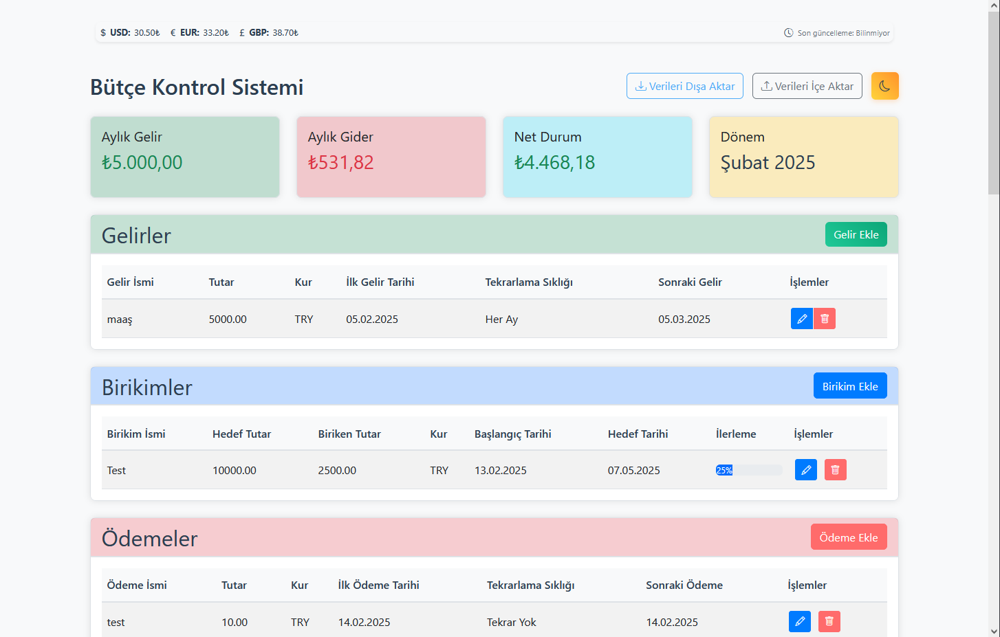
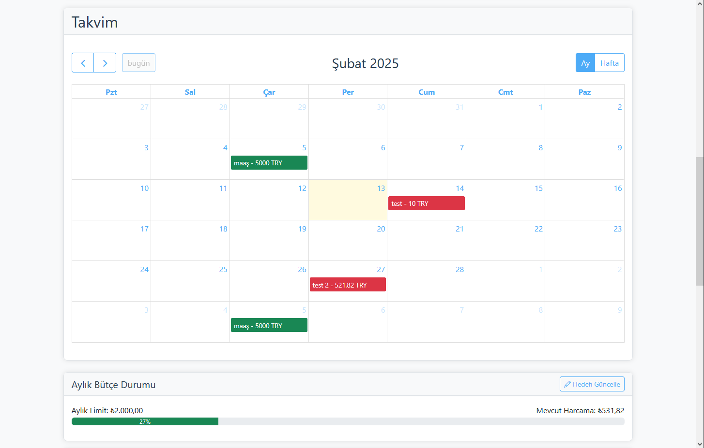
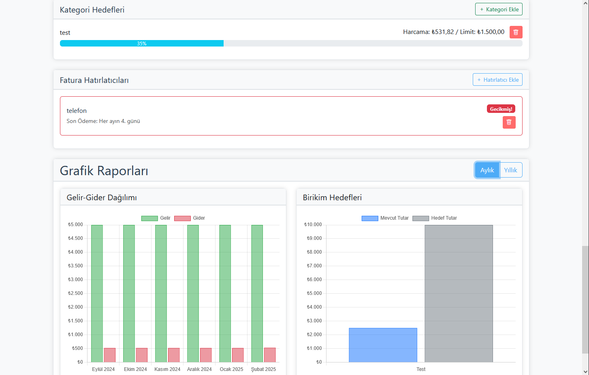
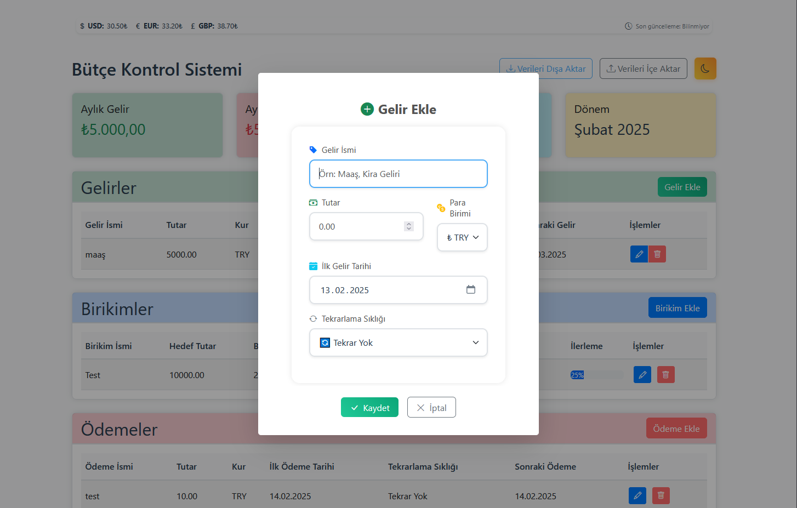
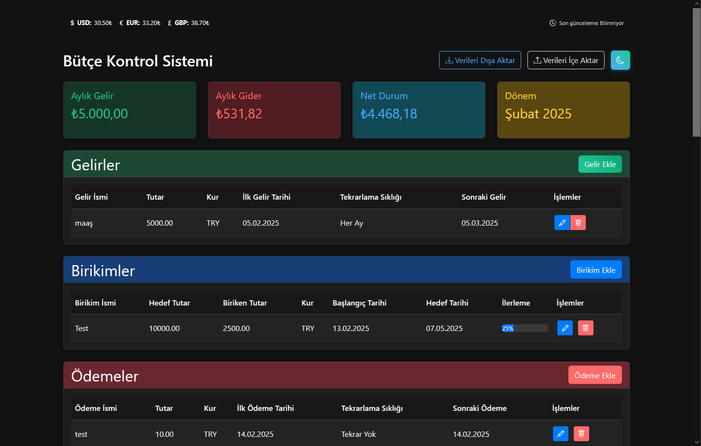

[🇹🇷 Türkçe](#bütçe-takip-sistemi) | [🇬🇧 English](#budget-control-system)

# Bütçe Takip Sistemi

Kişisel finans yönetimini kolaylaştıran modern bir web uygulaması.

## Özellikler

### 1. Gelir Yönetimi
- Tek seferlik ve düzenli gelirleri kaydetme
- Farklı para birimlerinde gelir ekleyebilme
- Otomatik tekrarlanan gelir kayıtları

### 2. Gider Takibi
- Tek seferlik ve düzenli ödemeleri kaydetme
- Farklı para birimlerinde gider ekleyebilme
- Otomatik tekrarlanan ödeme kayıtları

### 3. Birikim Hedefleri
- Hedef bazlı birikim planlaması
- İlerleme takibi
- Hedef tarihi belirleme
- Görsel ilerleme göstergeleri

### 4. Genel Özellikler
- Çoklu para birimi desteği (TRY, USD, EUR)
- Otomatik kur hesaplamaları
- Açık/Koyu tema seçeneği
- Responsive tasarım
- Kullanıcı dostu arayüz

## Teknik Özellikler

### Kullanılan Teknolojiler
- PHP 8.x
- MySQL/MariaDB
- JavaScript (jQuery)
- Bootstrap 5
- SweetAlert2
- Font Awesome Icons

### Güvenlik Özellikleri
- Şifre hash'leme (bcrypt)
- XSS koruması
- SQL injection koruması
- CSRF koruması
- "Beni Hatırla" özelliği için güvenli token sistemi

## Kurulum

1. Dosyaları web sunucunuza yükleyin
2. `database.sql` dosyasını veritabanınıza import edin
3. `config.php` dosyasını düzenleyin:
   ```php
   define('DB_SERVER', 'localhost');
   define('DB_USERNAME', 'kullanici_adi');
   define('DB_PASSWORD', 'sifre');
   define('DB_NAME', 'veritabani_adi');
   ```
4. Gerekli PHP eklentilerinin yüklü olduğundan emin olun:
   - PDO
   - PDO_MySQL
   - mbstring
   - json

## Dizin Yapısı

```
butce.local/
├── api/                    # API endpoint'leri
│   ├── auth.php           # Kimlik doğrulama işlemleri
│   ├── income.php         # Gelir işlemleri
│   ├── payment.php        # Ödeme işlemleri
│   └── savings.php        # Birikim işlemleri
├── js/                    # JavaScript dosyaları
│   ├── app.js            # Ana uygulama kodları
│   ├── auth.js           # Kimlik doğrulama
│   ├── income.js         # Gelir işlemleri
│   ├── payment.js        # Ödeme işlemleri
│   └── theme.js          # Tema yönetimi
├── modals/               # Modal bileşenleri
│   ├── income_modal.php  # Gelir modalları
│   ├── payment_modal.php # Ödeme modalları
│   └── savings_modal.php # Birikim modalları
├── css/                  # Stil dosyaları
├── app.php              # Ana uygulama
├── config.php           # Yapılandırma
├── index.php           # Karşılama sayfası
├── login.php           # Giriş sayfası
└── register.php        # Kayıt sayfası
```

## Veritabanı Şeması

### users
- id (INT, PRIMARY KEY)
- username (VARCHAR)
- password (VARCHAR)
- base_currency (VARCHAR)
- theme_preference (VARCHAR)
- remember_token (VARCHAR)
- created_at (TIMESTAMP)

### income
- id (INT, PRIMARY KEY)
- user_id (INT, FOREIGN KEY)
- name (VARCHAR)
- amount (DECIMAL)
- currency (VARCHAR)
- first_date (DATE)
- frequency (VARCHAR)
- next_date (DATE)
- status (ENUM)
- created_at (TIMESTAMP)

### payments
- id (INT, PRIMARY KEY)
- user_id (INT, FOREIGN KEY)
- name (VARCHAR)
- amount (DECIMAL)
- currency (VARCHAR)
- first_date (DATE)
- frequency (VARCHAR)
- next_date (DATE)
- status (ENUM)
- created_at (TIMESTAMP)

### savings
- id (INT, PRIMARY KEY)
- user_id (INT, FOREIGN KEY)
- name (VARCHAR)
- target_amount (DECIMAL)
- current_amount (DECIMAL)
- currency (VARCHAR)
- start_date (DATE)
- target_date (DATE)
- created_at (TIMESTAMP)

## Katkıda Bulunma

1. Bu depoyu fork edin
2. Yeni bir branch oluşturun (`git checkout -b feature/yeniOzellik`)
3. Değişikliklerinizi commit edin (`git commit -am 'Yeni özellik: XYZ'`)
4. Branch'inizi push edin (`git push origin feature/yeniOzellik`)
5. Pull Request oluşturun

## Lisans

Bu proje MIT lisansı altında lisanslanmıştır. Detaylar için `LICENSE` dosyasına bakın.

## İletişim

A. Kerem Gök - info@butcetakip.com

Proje Linki: [https://github.com/keremgok/butcetakip](https://github.com/keremgok/butcetakip)

---

# Budget Control System

This is a web application developed for personal budget control and tracking. It is designed as a Progressive Web App (PWA) and provides offline usage support.

## Features

- 💰 Income and expense tracking
- 💳 Payment planning
- 📊 Detailed reporting
- 💾 Offline functionality
- 📱 Mobile responsive design
- 🎯 Savings goals
- 🔄 Automatic backup
- 🌙 Dark mode

## Technologies

- HTML5
- CSS3
- JavaScript (ES6+)
- Service Workers
- IndexedDB
- PWA

## Installation

1. Clone the project

```bash
git clone https://github.com/hermesthecat/odeme_takip.git
```

2. Go to project directory

```bash
cd odeme_takip
```

3. Run with a web server

```bash
# Start a simple web server with Python
python -m http.server 8000
```

## Screenshots


_Home Page_


_Calendar_


_Mini Reports_


_Add Income_


_Dark Mode_

## License

MIT

## Author

A. Kerem Gök
