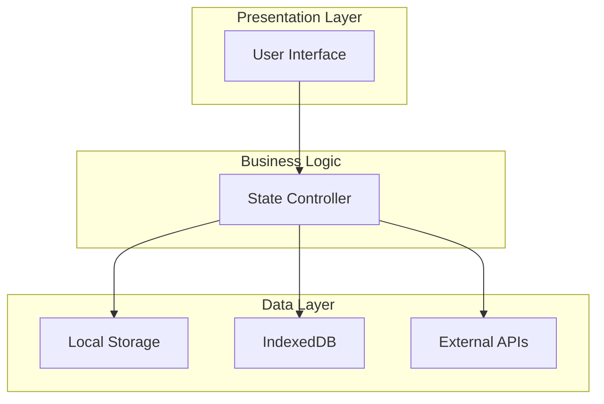
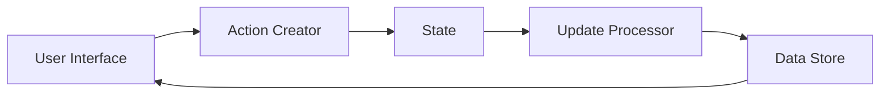
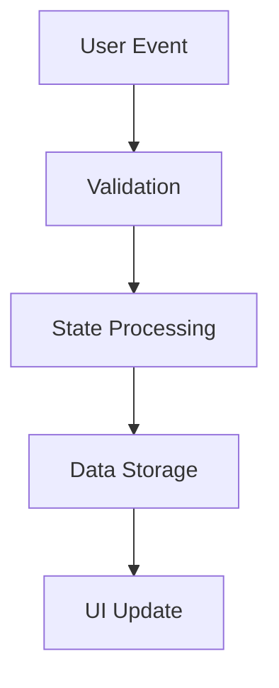
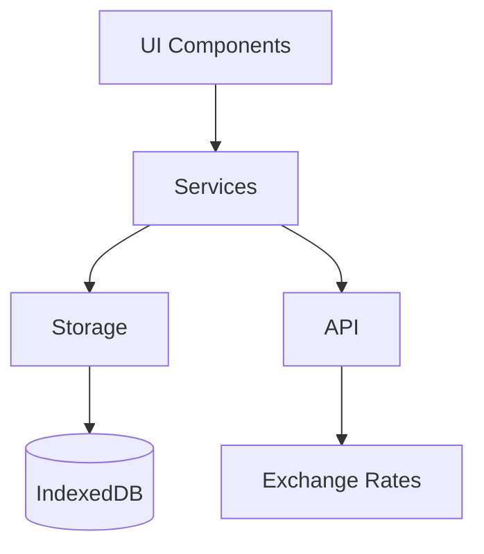

# System Patterns

## Architecture Overview

### Client-Side Architecture
The application follows a client-side architecture with complete offline capabilities:



## Design Patterns

### Data Management
1. **Repository Pattern**
   - Separate data access logic
   - LocalStorage for preferences
   - IndexedDB for transaction data
   - API integration for exchange rates

2. **Observer Pattern**
   - Real-time UI updates
   - Exchange rate monitoring
   - Budget goal tracking
   - Category expense monitoring

### UI Patterns
1. **Component-Based Architecture**
   - Modular UI components
   - Reusable elements
   - Consistent styling
   - Responsive design

2. **Progressive Enhancement**
   - Basic functionality without JavaScript
   - Enhanced features with JS
   - PWA capabilities
   - Offline support

## Key Technical Decisions

### Storage Strategy
1. **LocalStorage**
   - User preferences
   - Theme settings
   - Currency preferences
   - Last update timestamps

2. **IndexedDB**
   - Transaction records
   - Budget goals
   - Savings targets
   - Category definitions

### API Integration
1. **Exchange Rates**
   - Real-time currency conversion
   - Cached rates for offline use
   - Automatic updates
   - Fallback mechanisms

### PWA Implementation
1. **Service Workers**
   - Offline functionality
   - Cache management
   - Background sync
   - Push notifications

2. **App Shell Model**
   - Fast initial load
   - Cached core assets
   - Dynamic content loading
   - Optimized performance

## Component Relationships

### Data Flow


### Event Handling


## Code Organization

### Directory Structure
```
src/
├── components/
│   ├── common/
│   ├── forms/
│   └── views/
├── services/
│   ├── storage/
│   ├── api/
│   └── utils/
├── styles/
│   ├── themes/
│   └── components/
└── assets/
    ├── icons/
    └── images/
```

### Module Dependencies


## Security Patterns

### Data Protection
1. **Client-Side Encryption**
   - Sensitive data encryption
   - Secure storage practices
   - Data integrity checks

2. **API Security**
   - Rate limiting
   - Request validation
   - Error handling

## Performance Patterns

### Optimization Strategies
1. **Caching**
   - Service worker cache
   - API response cache
   - Static asset cache

2. **Lazy Loading**
   - Dynamic imports
   - Image optimization
   - On-demand data fetching

### Error Handling
1. **Graceful Degradation**
   - Offline fallbacks
   - API error recovery
   - Data validation

2. **User Feedback**
   - Loading states
   - Error messages
   - Success notifications
