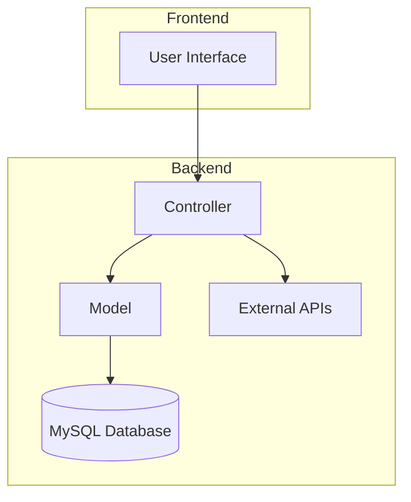
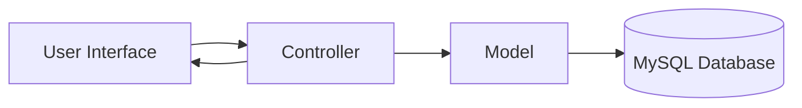
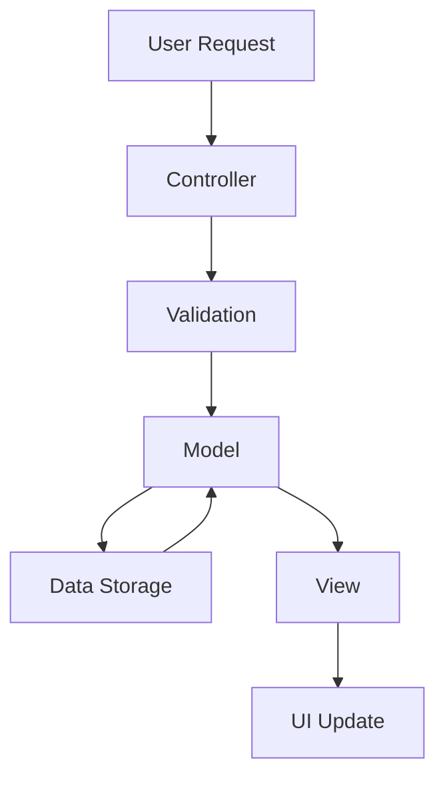
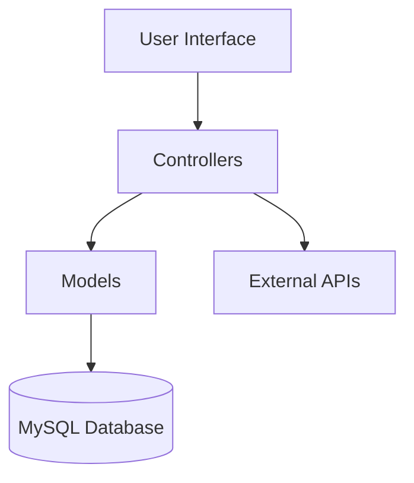

# System Patterns

## Architecture Overview

### PHP/MySQL Architecture
The application follows a server-side architecture using PHP and MySQL:



## Design Patterns

### Data Management
1. **Model-View-Controller (MVC)**
   - Separation of concerns
   - Database interaction through models
   - Request handling through controllers
   - Presentation through views

2. **Data Access Objects (DAO)**
   - Abstract database access
   - Encapsulate queries
   - Improve maintainability

### UI Patterns
1. **Template Engine**
   - Dynamic content rendering
   - Reusable templates
   - Consistent styling
   - Responsive design

## Key Technical Decisions

### Storage Strategy
1. **MySQL Database**
   - User data
   - Transaction records
   - Budget goals
   - Savings targets
   - Category definitions

### API Integration
1. **Exchange Rates**
   - Real-time currency conversion
   - Automatic updates
   - Fallback mechanisms

## Component Relationships

### Data Flow


### Request Handling


## Code Organization

### Directory Structure
```
/
├── config/
│   └── database.php
├── controllers/
│   ├── IncomeController.php
│   ├── ExpenseController.php
│   └── ...
├── models/
│   ├── Income.php
│   ├── Expense.php
│   └── ...
├── views/
│   ├── income/
│   ├── expense/
│   └── ...
├── public/
│   ├── css/
│   ├── js/
│   └── index.php
└── index.php
```

### Module Dependencies


## Security Patterns

### Data Protection
1. **Input Validation**
   - Sanitize user inputs
   - Prevent SQL injection
   - Validate data types

2.  **Authentication and Authorization**
    - Secure user registration
    - Password hashing
    - Session management

### API Security
1. **Rate Limiting**
   - Limit API requests
   - Prevent abuse
   - Ensure availability

2. **Request Validation**
   - Validate API requests
   - Prevent unauthorized access
   - Ensure data integrity

## Performance Patterns

### Optimization Strategies
1. **Database Optimization**
   - Indexing
   - Query optimization
   - Connection pooling

2. **Caching**
   - API response cache
   - Database query cache
   - Output caching

### Error Handling
1. **Exception Handling**
   - Centralized error handling
   - Logging
   - User-friendly messages

2. **Data Validation**
   - Server-side validation
   - Data integrity checks
   - Error reporting

3. **User Feedback**
   - Loading states
   - Error messages
   - Success notifications
